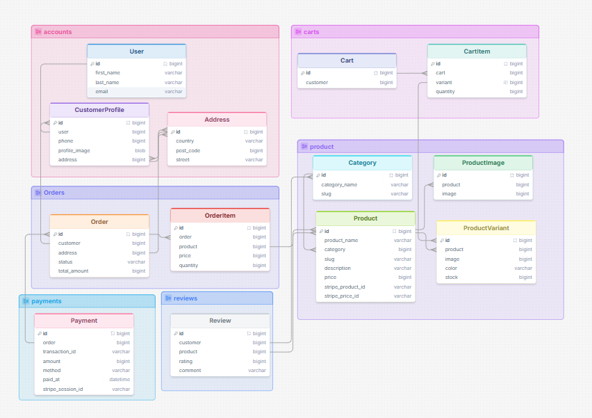

# E-Commerce website

A single vander user friendly website. Where people can buy product easly.
Key features:
- user authentication
- product list
- product category
- cart product
- stripe payment gateway 

## Setup & Run

### Prerequisites

- Python 3.11+
- pip

---

### 1. Clone the Repository

```bash
git clone https://github.com/Shuvo018/E-Commerce-ostad.git
cd E-Commerce-ostad
```

### 2. Create and Activate a Virtual Environment

```bash
python -m venv venv

# Linux / macOS
source venv/bin/activate

# Windows
venv\Scripts\activate
```

### 3. Install Dependencies

```bash
pip install -r requirements.txt
```

### 4. Apply Migrations

```bash
python manage.py migrate
```

### 5. Create a Superuser

```bash
python manage.py createsuperuser
```


### 6. Run the Development Server

```bash
python manage.py runserver
```

App: [http://127.0.0.1:8000](http://127.0.0.1:8000)  
Admin: [http://127.0.0.1:8000/admin](http://127.0.0.1:8000/admin)

---

## Payment gateway: Prevent duplicate payment

```bash

views.py:
    # Check if there's already a Pending order for this cart to prevent double-payment
    existing_pending = Order.objects.filter(customer=customer, status='Pending').first()
    if existing_pending:
        # Reuse existing pending order and its Stripe session
        payment = Payment.objects.filter(order=existing_pending).first()
        if payment and payment.stripe_session_id:
            try:
                session = stripe.checkout.Session.retrieve(payment.stripe_session_id)
                if session.payment_status != 'paid':
                    # Session is still valid and not paid, redirect to it
                    return redirect(session.url, permanent=False)
            except Exception:
                pass
        # If we can't reuse the session, delete the old order and create a new one
        existing_pending.delete()
        .
        .
        .
    # clear cart
    cart.cart_items.all().delete()
    cart.delete()
```

```bash
webhook.py:

    if event_type == 'checkout.session.completed':
        if isinstance(event, dict):
            obj = event.get('data', {}).get('object', {})
        else:
            obj = getattr(getattr(event, 'data', {}), 'object', {})
        metadata = _get_metadata_from_stripe_object(obj)
        order_id = metadata.get('order_id')
        if order_id:
            order = Order.objects.filter(pk=order_id).first()
            if order:
                # Idempotency: only update if not already paid
                if order.status != 'Paid':
                    order.status = 'Paid'
                    order.save()
                    print('checkout.session.completed payment paid')
                else:
                    print('Order already marked as Paid:', order_id)
            else:
                print('Order not found for checkout.session.completed:', order_id)
        else:
            print('Missing order_id metadata for checkout.session.completed')


```

## ER diagram

